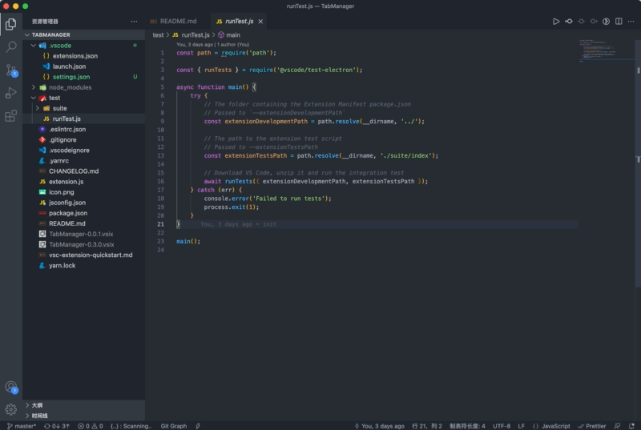

## 类似浏览器标签栏功能的插件
---


### 主要功能

1. 标签页列表
2. 附加参数设置
3. GIT参数设置
4. 可选的打开方式

### 使用方式

1. 命令方式
2. 右键菜单

### 配置参考

```js

{
    "TabManager.tabList": [
        {
            "tabName": "baidu", // 标签名称
            "tabUrl": "https://www.baidu.com/s", // 标签地址
            "params": {
                "wd": "JavaScript" // 参数列表
            },
            "useGitParams": false, // 是否添加分支参数
            "branchKey": "branch", // 分支参数名称
            "useBrowser": true, // 使用默认浏览器打开页面
            "packageParams": { // package.json 中的参数 可以是数组 也可以是 对象
                "name": "wd" // name 为package.json中key, "wd" 为url 上的key
            }
        },
        {
            "tabName": "vue",
            "tabUrl": "https://cn.vuejs.org/",
            "params": {},
            "useGitParams": false,
            "branchKey": "branch",
            "useBrowser": false,
            "packageParams": ["name"]
        },
    ]
}

```


